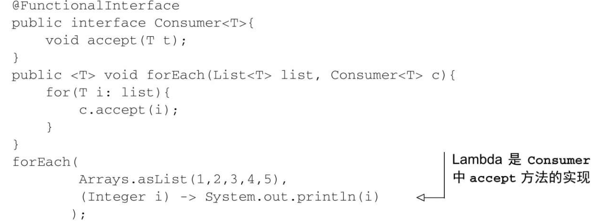

# 1.基础知识

## 1.行为化参数

* 行为参数化就是一个方法接受多个不同的行为作为参数，并在内部使用它们，完成不同行为的能力。
* 行为参数化可让代码更好地适应不断变化的要求，减轻未来的工作量。
* 传递代码就是将新行为作为参数传递给方法。但在Java 8之前这实现起来很啰唆。为接口声明许多只用一次的实体类而造成的啰唆代码，在Java 8之前可以用匿名类来减少。
* Java API包含很多可以用不同行为进行参数化的方法，包括排序、线程和GUI处理。

---

## 2.Lambda 表达式

可以把Lambda表达式理解为一种简洁的可传递匿名函数：它没有名称，但它有参数列表、函数主体、返回类型，可能还有一个可以抛出的异常列表。

* 匿名——说它是匿名的，因为它不像普通的方法那样有一个明确的名称：写得少而想得多
* 函数——说它是一种函数，是因为Lambda函数不像方法那样属于某个特定的类。但和方法一样，Lambda有参数列表、函数主体、返回类型，还可能有可以抛出的异常列表
* 传递——Lambda表达式可以作为参数传递给方法或存储在变量中
* 简洁——你无须像匿名类那样写很多模板代码

---

### 1.Lambda 组成

Lambda表达式由参数、箭头和主体组成

* 参数列表——这里它采用了Comparator中compare方法的参数，两个Apple。
* 箭头——箭头->把参数列表与Lambda主体分隔开。
* Lambda主体——比较两个Apple的重量。表达式就是Lambda的返回值。

---

### 2.Lambda 格式

```java
          (1) () -> {}
          (2) () -> "Raoul"
          (3) () -> {return "Mario"; }
          (4) (Integer i) -> return "Alan" + i;
          (5) (String s) -> {"Iron Man"; }
```

除了四五均为正确的 Lambda ，四需要大括号，无需要加 return 或者去除括号和分号

---

### 3.lambda 使用例子


---

### 4.在哪里使用lambda

使用 lambda 必须有一个函数式接口

---

#### 1.何为函数式接口

```java
        public interface Predicate<T>{
            boolean test (T t);
        }
```

函数式接口就是只定义一个抽象方法的接口

如果有多个默认方法，只要抽象方法只有一个那就是函数式接口

---

#### 2.函数式接口可以做什么

Lambda表达式允许你直接以内联的形式为函数式接口的抽象方法提供实现，并把整个表达式作为函数式接口的实例（具体说来，是函数式接口一个具体实现的实例）


---

### 5.函数描述符

函数式接口的抽象方法的签名基本上就是Lambda表达式的签名。我们将这种抽象方法叫作函数描述符

方法调用的返回值为空时，Java语言规范有一条特殊的规定。这种情况下，你不需要使用括号环绕返回值为空的单行方法调用

---

以下哪些是使用Lambda表达式的有效方式？

```java 
(1)execute(() -> {});
        public void execute(Runnable r){
           r.run();
        }
(2)public Callable<String> fetch() {
        return () -> "Tricky example   ; -)";
        }
(3)Predicate<Apple> p = (Apple a) -> a.getWeight();
```

答案：只有(1)和(2)是有效的。

第(1)个例子有效，是因为Lambda() -> {}具有签名() -> void，这和Runnable中的抽象方法run的签名相匹配。请注意，此代码运行后什么都不会做，因为Lambda是空的！

第(2)个例子也是有效的。事实上，fetch方法的返回类型是Callable<String>。Callable<String>基本上就定义了一个方法，签名是() -> String，其中T被String代替了。因为Lambda() -> "Trickyexample; -)"的签名是() -> String，所以在这个上下文中可以使用Lambda。

第(3)个例子无效，因为Lambda表达式(Apple a) -> a.getWeight()的签名是(Apple)->Integer，这和Predicate<Apple>: (Apple) -> boolean中定义的test方法的签名不同。

---

### 6.环绕执行模式

打开一个资源，做一些处理，然后关闭资源。这个设置和清理阶段总是很类似，并且会围绕着执行处理的那些重要代码。这就是所谓的环绕执行模式


---

### 7.常见的函数式接口

#### 1.Predicate

java.util.function.Predicate<T>接口定义了一个名叫test的抽象方法，它接受泛型T对象，并返回一个boolean。

这恰恰和你先前创建的一样，现在就可以直接使用了。

在你需要表示一个涉及类型T的布尔表达式时，就可以使用这个接口。

比如，你可以定义一个接受String对象的Lambda表达式，如下所示。

```java
        @FunctionalInterface
        public interface Predicate<T> {
            boolean test(T t);
        }
        public <T> List<T> filter(List<T> list, Predicate<T> p) {
            List<T> results = new ArrayList<>();
            for(T t: list) {
                if(p.test(t)) {
                    results.add(t);
                }
            }
            return results;
        }
        Predicate<String> nonEmptyStringPredicate = (String s) -> ! s.isEmpty();
        List<String> nonEmpty = filter(listOfStrings, nonEmptyStringPredicate);
```

---

#### 2.Consumer

java.util.function.Consumer<T>接口定义了一个名叫accept的抽象方法，它接受泛型T的对象，没有返回（void）。

你如果需要访问类型T的对象，并对其执行某些操作，就可以使用这个接口。

比如，你可以用它来创建一个forEach方法，接受一个Integers的列表，并对其中每个元素执行操作。

在下面的代码中，你就可以使用这个forEach方法，并配合Lambda来打印列表中的所有元素。



---

#### 3.Function

java.util.function.Consumer<T>接口定义了一个名叫accept的抽象方法，它接受泛型T的对象，没有返回（void）。

你如果需要访问类型T的对象，并对其执行某些操作，就可以使用这个接口。

比如，你可以用它来创建一个forEach方法，接受一个Integers的列表，并对其中每个元素执行操作。

在下面的代码中，你就可以使用这个forEach方法，并配合Lambda来打印列表中的所有元素。


---

Java 8为前面所说的函数式接口带来了一个专门的版本，以便在输入和输出都是基本类型时避免自动装箱的操作

比如，在下面的代码中，使用IntPredicate就避免了对值1000进行装箱操作，但要是用Predicate<Integer>就会把参数1000装箱到一个Integer对象中


一般来说，针对专门的输入参数类型的函数式接口的名称都要加上对应的基本类型前缀，比如DoublePredicate、IntConsumer、LongBinaryOperator、IntFunction等。

Function接口还有针对输出参数类型的变种：ToIntFunction<T>、IntToDoubleFunction等。