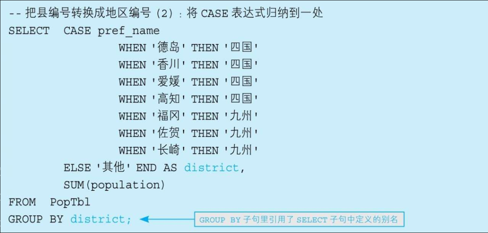
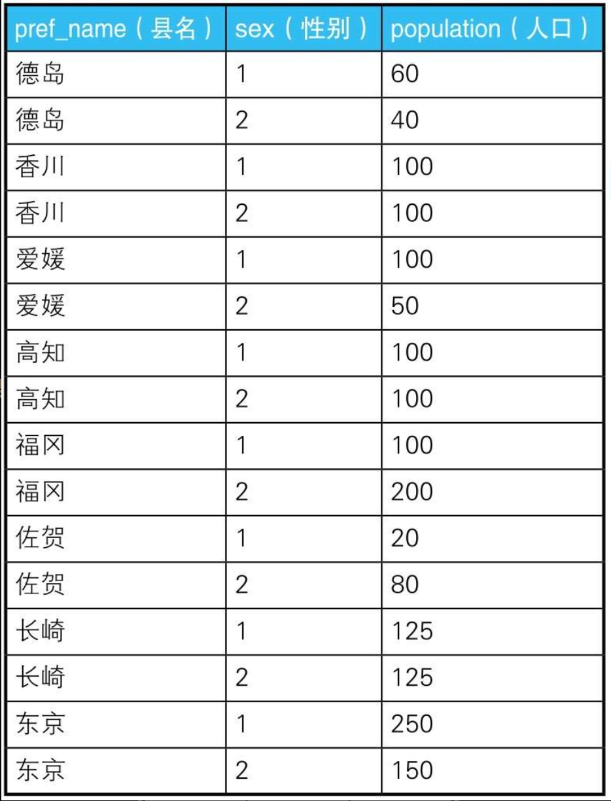
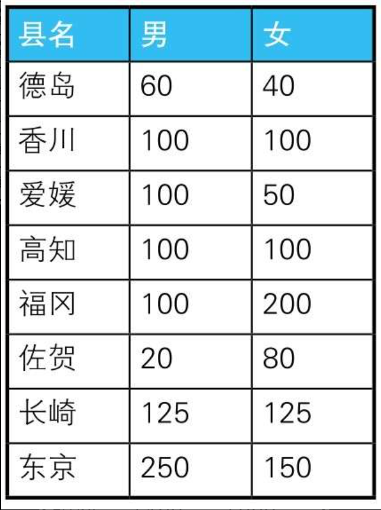
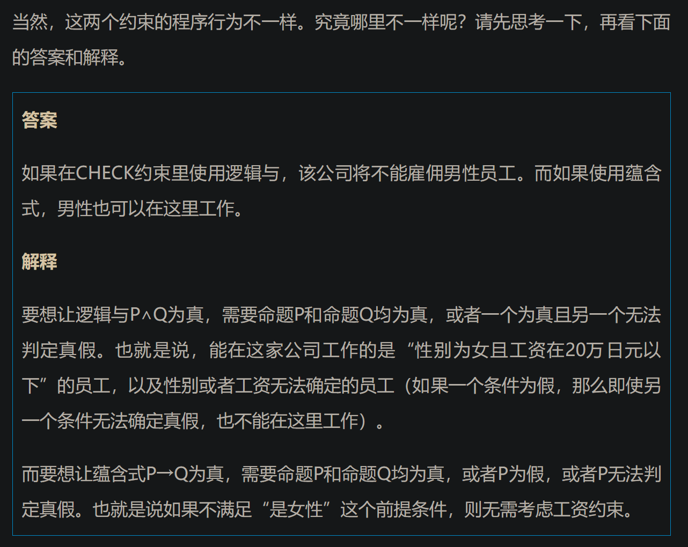
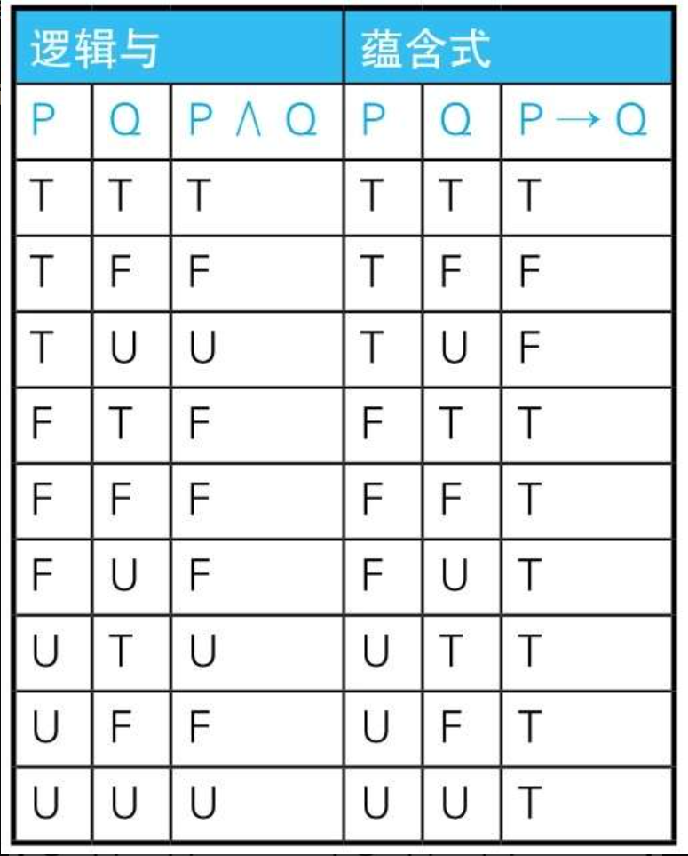

# 1.CASE 表达式

```sql
    --简单CASE表达式
    CASE sex
      WHEN '1' THEN ’男’
      WHEN '2' THEN ’女’
    ELSE ’其他’ END

    --搜索CASE表达式
    CASE WHEN sex ='1'THEN’男’
        WHEN sex ='2'THEN’女’
    ELSE ’其他’ END
```

---

## CASE 表达式注意事项

注意事项1：统一各分支返回的数据类型虽然这一点无需多言，但这里还是要强调一下：一定要注意CASE表达式里各个分支返回的 `数据类型 `是否 `一致 `。某个分支返回字符型，而其他分支返回数值型的写法是不正确的。

---

注意事项2：`不要忘了写END `使用CASE表达式的时候，最容易出现的语法错误是忘记写END。虽然忘记写时程序会返回比较容易理解的错误消息，不算多么致命的错误。但是，感觉自己写得没问题，而执行时却出错的情况大多是由这个原因引起的，所以请一定注意一下。

---

注意事项3：养成写ELSE子句的习惯与END不同，ELSE子句是可选的，不写也不会出错。不写ELSE子句时，CASE表达式的 `执行结果 是NULL `。但是不写可能会造成“语法没有错误，结果却不对”这种不易追查原因的麻烦，所以最好明确地写上ELSE子句（即便是在结果可以为NULL的情况下）。养成这样的习惯后，我们从代码上就可以清楚地看到这种条件下会生成NULL，而且将来代码有修改时也能减少失误。

---



后期需要修改的时候，很容易发生只改了这一处而忘掉改另一处的失误。所以，如果我们可以像上面这样写，那就方便多了。

没错，这里的GROUP BY子句使用的正是SELECT子句里定义的列的别称——district。但是严格来说，这种写法是 `违反标准SQL的规则 `的。因为GROUP BY子句比SELECT语句先执行，所以在GROUP BY子句中引用在SELECT子句里定义的别称是不被允许的。事实上，在Oracle、DB2、SQL Server等数据库里采用这种写法时就会出错。

---

```SQL
    -- 男性人口
    SELECT pref_name,
          SUM(population)
      FROM PopTbl2
     WHERE sex ='1'
     GROUP BY pref_name;


    -- 女性人口
    SELECT pref_name,
          SUM(population)
      FROM PopTbl2
     WHERE sex ='2'
     GROUP BY pref_name;
```

```SQL
    SELECT pref_name,
          --男性人口
          SUM( CASE WHEN sex ='1'THEN population ELSE 0 END) AS cnt_m,
          --女性人口
          SUM( CASE WHEN sex ='2'THEN population ELSE 0 END) AS cnt_f
      FROM  PopTbl2
     GROUP BY pref_name;
```

除了SUM, COUNT、AVG等聚合函数也都可以用于将行结构的数据转换成列结构的数据





---

用CHECK约束定义多个列的条件关系

假设某公司规定“女性员工的工资必须在20万日元以下”，而在这个公司的人事表中，这条无理的规定是使用CHECK约束来描述的，代码如下所示。

```sql
    CONSTRAINT check_salary CHECK
              ( CASE WHEN sex ='2'
                      THEN CASE WHEN salary <= 200000
                              THEN 1 ELSE 0 END
                      ELSE 1 END = 1 )
```

在这段代码里，CASE表达式被嵌入到CHECK约束里，描述了“如果是女性员工，则工资是20万日元以下”这个命题。

在命题逻辑中，该命题是叫作蕴含式（conditional）的逻辑表达式，记作P→Q。这里需要重点理解的是蕴含式和逻辑与（logical product）的区别。

逻辑与也是一个逻辑表达式，意思是“P且Q”，记作P∧Q。用逻辑与改写的CHECK约束如下所示。

```sql
    CONSTRAINT check_salary CHECK
              ( sex ='2'AND salary <= 200000 )
```



## 逻辑与 和 蕴含式



---

在UPDATE语句里进行条件分支