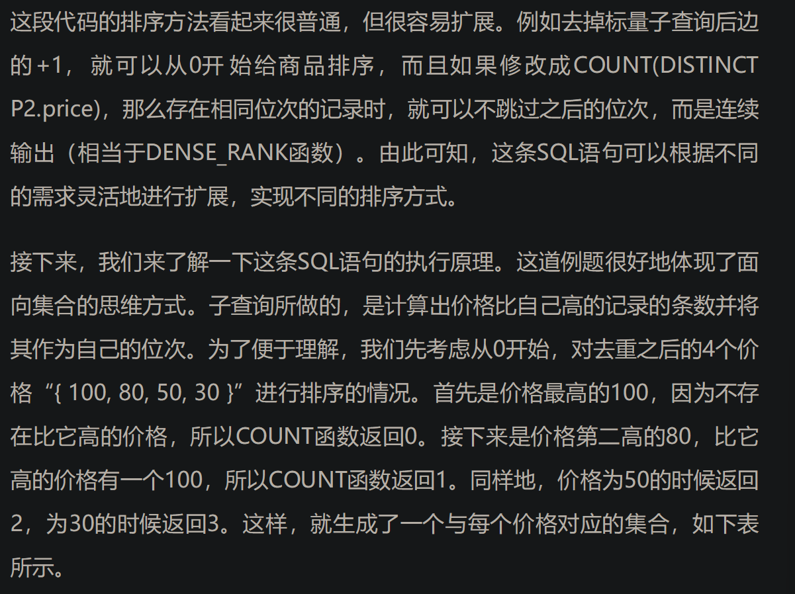
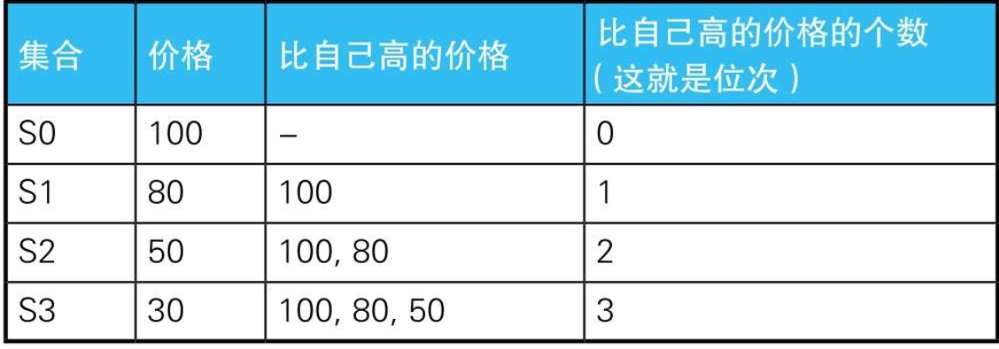

# 1.CASE 表达式

```sql
    --简单CASE表达式
    CASE sex
      WHEN '1' THEN ’男’
      WHEN '2' THEN ’女’
    ELSE ’其他’ END

    --搜索CASE表达式
    CASE WHEN sex ='1'THEN’男’
        WHEN sex ='2'THEN’女’
    ELSE ’其他’ END
```

---

## 1.1 CASE 表达式注意事项

注意事项1：统一各分支返回的数据类型虽然这一点无需多言，但这里还是要强调一下：一定要注意CASE表达式里各个分支返回的 `数据类型 `是否 `一致 `。某个分支返回字符型，而其他分支返回数值型的写法是不正确的。

---

注意事项2：`不要忘了写END `使用CASE表达式的时候，最容易出现的语法错误是忘记写END。虽然忘记写时程序会返回比较容易理解的错误消息，不算多么致命的错误。但是，感觉自己写得没问题，而执行时却出错的情况大多是由这个原因引起的，所以请一定注意一下。

---

注意事项3：养成写ELSE子句的习惯与END不同，ELSE子句是可选的，不写也不会出错。不写ELSE子句时，CASE表达式的 `执行结果 是NULL `。但是不写可能会造成“语法没有错误，结果却不对”这种不易追查原因的麻烦，所以最好明确地写上ELSE子句（即便是在结果可以为NULL的情况下）。养成这样的习惯后，我们从代码上就可以清楚地看到这种条件下会生成NULL，而且将来代码有修改时也能减少失误。

---


后期需要修改的时候，很容易发生只改了这一处而忘掉改另一处的失误。所以，如果我们可以像上面这样写，那就方便多了。

没错，这里的GROUP BY子句使用的正是SELECT子句里定义的列的别称——district。但是严格来说，这种写法是 `违反标准SQL的规则 `的。因为GROUP BY子句比SELECT语句先执行，所以在GROUP BY子句中引用在SELECT子句里定义的别称是不被允许的。事实上，在Oracle、DB2、SQL Server等数据库里采用这种写法时就会出错。

---

```SQL
    -- 男性人口
    SELECT pref_name,
          SUM(population)
      FROM PopTbl2
     WHERE sex ='1'
     GROUP BY pref_name;


    -- 女性人口
    SELECT pref_name,
          SUM(population)
      FROM PopTbl2
     WHERE sex ='2'
     GROUP BY pref_name;
```

```SQL
    SELECT pref_name,
          --男性人口
          SUM( CASE WHEN sex ='1'THEN population ELSE 0 END) AS cnt_m,
          --女性人口
          SUM( CASE WHEN sex ='2'THEN population ELSE 0 END) AS cnt_f
      FROM  PopTbl2
     GROUP BY pref_name;
```

除了SUM, COUNT、AVG等聚合函数也都可以用于将行结构的数据转换成列结构的数据


---

用CHECK约束定义多个列的条件关系

假设某公司规定“女性员工的工资必须在20万日元以下”，而在这个公司的人事表中，这条无理的规定是使用CHECK约束来描述的，代码如下所示。

```sql
    CONSTRAINT check_salary CHECK
              ( CASE WHEN sex ='2'
                      THEN CASE WHEN salary <= 200000
                              THEN 1 ELSE 0 END
                      ELSE 1 END = 1 )
```

在这段代码里，CASE表达式被嵌入到CHECK约束里，描述了“如果是女性员工，则工资是20万日元以下”这个命题。

在命题逻辑中，该命题是叫作蕴含式（conditional）的逻辑表达式，记作P→Q。这里需要重点理解的是蕴含式和逻辑与（logical product）的区别。

逻辑与也是一个逻辑表达式，意思是“P且Q”，记作P∧Q。用逻辑与改写的CHECK约束如下所示。

```sql
    CONSTRAINT check_salary CHECK
              ( sex ='2'AND salary <= 200000 )
```


## 1.2逻辑与 和 蕴含式


---

在UPDATE语句里进行条件分支

```sql
    --条件1
    UPDATE Salaries
      SET salary = salary ＊ 0.9
     WHERE salary >= 300000;


    --条件2
    UPDATE Salaries
      SET salary = salary ＊ 1.2
     WHERE salary >= 250000 AND salary < 280000;
```

```sql
    --用CASE表达式写正确的更新操作
    UPDATE Salaries
      SET salary = CASE WHEN salary >= 300000
                        THEN salary ＊ 0.9
                        WHEN salary >= 250000 AND salary < 280000
                        THEN salary ＊ 1.2
                        ELSE salary END;
```

---

调换主键

通常，当我们想调换主键值a和b时，需要将主键值临时转换成某个中间值。使用这种方法时需要执行3次UPDATE操作，但是如果使用CASE表达式，1次就可以做到。

如果在调换上表的主键值a和b时不用CASE表达式，则需要像下面这样写3条SQL语句。  

像上面这样做，结果确实没有问题。只是，这里没有必要执行3次UPDATE操作，而且中间值d是否总能使用也是问题。而如果使用CASE表达式，就不必担心这些，1次就可以完成调换。

```sql
    --1．将a转换为中间值d
    UPDATE SomeTable
      SET p_key ='d'
     WHERE p_key ='a';


    --2．将b调换为a
    UPDATE SomeTable
      SET p_key ='a'

      WHERE p_key ='b';


     --3．将d调换为b
     UPDATE SomeTable
        SET p_key ='b'
      WHERE p_key ='d';
```

```sql
    --用CASE表达式调换主键值
    UPDATE SomeTable
      SET p_key = CASE WHEN p_key ='a'
                        THEN 'b'
                        WHEN p_key ='b'
                        THEN 'a'
                        ELSE p_key END
     WHERE p_key IN ('a', 'b');
```

---

## 1.3表之前的数据匹配

与DECODE函数等相比，CASE表达式的一大优势在于能够判断表达式。也就是说，在CASE表达式里，我们可以使用BETWEEN、LIKE和<、>等便利的谓词组合，以及能嵌套子查询的IN和EXISTS谓词。因此，CASE表达式具有非常强大的表达能力。

```sql
    --表的匹配：使用IN谓词
    SELECT course_name,
          CASE WHEN course_id IN
                        (SELECT course_id FROM OpenCourses
                          WHERE month = 200706) THEN'○'
                ELSE'×'END AS "6月",
          CASE WHEN course_id IN
                        (SELECT course_id FROM OpenCourses
                          WHERE month = 200707) THEN'○'
                ELSE'×'END AS "7月",
          CASE WHEN course_id IN
                        (SELECT course_id FROM OpenCourses
                          WHERE month = 200708) THEN'○'
                ELSE'×'END  AS "8月"
      FROM CourseMaster;


    --表的匹配：使用EXISTS谓词
    SELECT CM.course_name,
          CASE WHEN EXISTS
                        (SELECT course_id FROM OpenCourses OC
                          WHERE month = 200706

                              AND OC.course_id = CM.course_id) THEN'○'
                  ELSE'×'END AS "6月",
              CASE WHEN EXISTS
                          (SELECT course_id FROM OpenCourses OC
                            WHERE month = 200707
                              AND OC.course_id = CM.course_id) THEN'○'
                  ELSE'×'END AS "7月",
              CASE WHEN EXISTS
                          (SELECT course_id FROM OpenCourses OC
                            WHERE month = 200708
                              AND OC.course_id = CM.course_id) THEN'○'
                  ELSE'×'END  AS "8月"
        FROM CourseMaster CM;
```

---

在CASE表达式中使用聚合函数

接下来介绍一下稍微高级的用法。这个用法乍一看可能让人觉得像是语法错误，实际上却并非如此。我们来看一道例题，假设这里有一张显示了学生及其加入的社团的一览表。如表StudentClub所示，这张表的主键是“学号、社团ID”，存储了学生和社团之间多对多的关系。

```sql
    SELECT  std_id,
            CASE WHEN COUNT(＊) = 1  --只加入了一个社团的学生
                THEN MAX(club_id)
                ELSE MAX(CASE WHEN main_club_flg ='Y'
                              THEN club_id
                              ELSE NULL END)
            END AS main_club
      FROM StudentClub
     GROUP BY std_id;
```

---

新手用HAVING子句进行条件分支，高手用SELECT子句进行条件分支。

---

CASE表达式经常会因为同VB和C语言里的CASE“语句”混淆而被叫作CASE语句。

但是准确来说，它并不是语句，而是和1+1或者a/b一样属于表达式的范畴。

结束符END确实看起来像是在标记一连串处理过程的终结，所以初次接触CASE表达式的人容易对这一点感到困惑。

“表达式”和“语句”的名称区别恰恰反映了两者在功能处理方面的差异。

作为表达式，CASE表达式在执行时会被判定为一个固定值，因此它可以写在聚合函数内部；

也正因为它是表达式，所以还可以写在SELECE子句、GROUP BY子句、WHERE子句、ORDER BY子句里。

简单点说，在能写列名和常量的地方，通常都可以写CASE表达式。

从这个意义上来说，与CASE表达式最接近的不是面向过程语言里的CASE语句，而是Lisp和Scheme等函数式语言里的case和cond这样的条件表达式

---

下面是本节要点。

1. 在GROUP BY子句里使用CASE表达式，可以灵活地选择作为聚合的单位的编号或等级。这一点在进行非定制化统计时能发挥巨大的威力。

2. 在聚合函数中使用CASE表达式，可以轻松地将行结构的数据转换成列结构的数据。

3. 相反，聚合函数也可以嵌套进CASE表达式里使用。

4. 相比依赖于具体数据库的函数，CASE表达式有更强大的表达能力和更好的可移植性。

5. 正因为CASE表达式是一种表达式而不是语句，才有了这诸多优点。

---

# 2.窗口函数


---

# 3.自连接的用法

## 3.1.有序对和无序对

组合其实分为两种类型

一种是有顺序的`有序对`（ordered pair）

另一种是无顺序的`无序对`（unordered pair）。

有序对用`尖括号`括起来，如<1, 2>

无序对用`花括号`括起来，如{1, 2}。

在有序对里，如果元素顺序相反，那就是不同的对，因此<1, 2>≠<2, 1>

而无序对与顺序无关，因此{1, 2}＝{2, 1}。

用学校里学到的术语来说，这两类分别对应着“排列”和“组合”

---

如果需要消除相同元素可以使用 `<>`

如果需要消除有序对（元素相同，但是顺序不同）可以使用 `>`

---

## 3.2.删除重复行

```sql
    --用于删除重复行的SQL语句(1)：使用极值函数
    DELETE FROM Products P1
     WHERE rowid < ( SELECT MAX(P2.rowid)
                      FROM Products P2
                      WHERE P1.name = P2. name
                        AND P1.price = P2.price ) ;
```

```sql
    --用于删除重复行的SQL语句(2)：使用非等值连接
    DELETE FROM Products P1
     WHERE EXISTS ( SELECT ＊
                      FROM Products P2
                    WHERE P1.name = P2.name
                      AND P1.price = P2.price
                      AND P1.rowid < P2.rowid );
```

---

## 3.3.查找局部数据不同

```sql
    --用于查找是同一家人但住址却不同的记录的SQL语句
    SELECT DISTINCT A1.name, A1.address
      FROM Addresses A1, Addresses A2
     WHERE A1.family_id = A2.family_id
      AND A1.address <> A2.address ;
```

---

## 3.4.排序

```sql
    --排序：使用窗口函数
    SELECT name, price,
          RANK() OVER (ORDER BY price DESC) AS rank_1,
          DENSE_RANK() OVER (ORDER BY price DESC) AS rank_2
      FROM Products;
```

使用下面子查询的方式也能达到上面使用窗口函数的效果

```sql
    --排序从1开始。如果已出现相同位次，则跳过之后的位次
    SELECT P1.name,
          P1.price,
          (SELECT COUNT(P2.price)
              FROM Products P2
            WHERE P2.price > P1.price) + 1 AS rank_1
      FROM Products P1
      ORDER BY rank_1;
```

如果需要实现 `dense_rank` 的效果可以在 `count` 函数中添加 `distinct`





使用自连接

```sql
    --排序：使用自连接
    SELECT P1.name,
          MAX(P1.price) AS price,
          COUNT(P2.name) +1 AS rank_1
      FROM Products P1 LEFT OUTER JOIN Products P2
        ON P1.price < P2.price
     GROUP BY P1.name
     ORDER BY rank_1;
```

---

# 3.三值逻辑和 NULL

## 3.1.两种 NULL

* 未知 （unknown）-不知道戴墨镜人眼睛的颜色
* 不适用 （not applicable，inapplicable，N/A） -不知道冰箱的眼睛是什么颜色

>为什么不能使用 X = NULL
>
>因为跟 NULL 做逻辑运算（谓词比较）得到的结果都是 unknown
>
>用 where 做筛选的时候只会选择 true 的记录，所以就算可以使用 null 也是匹配不到任何结果的
>
>所以需要使用 IS NULL 注意这里两个单词是一个整体，并不是 某某的值为 NULL 

真值 unknown 和 NULL 作为一种 UNKNOWN 是不同的东西

>假定 x=unknown
>
>x = unknown => true
>
>x = null => unknown

---

## 3.2.三值逻辑的运算结果

优先级

AND => false > unknown > true

OR => true > unknown > false

---

## 3.3.排中律

>不认可中间状态，即只有 true 和 false 结果

假设一张学生表，学生年龄存在 null 如果按照排中律，我们选择等于 20 或者 不是 20 的应该是可以选择到 null 的数据，但是事实上并不可以，因为 `SQL` 中排中律不成立，因为排中律只有 true 和 false ,如果按照上面的条件写 SQL 语句按照上面说的对 null 使用任何比较谓词都为 unknown 又因为 where 是选取 true 的记录，所以就得不到 null 的记录

---

## 3.4. CASE 表达式和 NULL

case 的 when 也是一样的道理，只会匹配 true ，所以如果 when 需要匹配 NULL 请使用 IS NULL

---

## 3.5. NOT IN 和 NOT EXISTS

 使用  not in 里面的参数如果有 null 则不会匹配到任何数据

因为在进行 not in 操作的时候会拆分为一个个 and 和 = ，因为对 null 使用等于谓词比较的结果为 unknown ，再加上 and 最后的结果就为 unknown 

如果需要得到正确的结果我们需要使用 NOT EXISTS 

因为 EXISTS 永远不会返回 unknown

---

## 3.6.限定谓词和 NULL

any 与 in 等价 

all 可以和比较谓词使用，来表达

* 和所有的相等
* 和所有的都大

---

## 3.7. 限定谓词和极值函数不等价

极值函数在统计的时候会排除掉 NULL

但是如果集合为空极值函数返回的就会为 NULL

---

## 3.8.聚合函数和 NULL

聚合函数和极值函数一样如果为空集合返回的就为 NULL

---

## 3.9. Oracle 的空串和 NULL

在其他 DBMS 中，字符串和空串连接得到的结果还会是字符串，但是如果为 NULL 就会返回 NULL

但是在 Oracle 中就不一样了，NULL还是会返回字符串

Oracle 中会将空串视为 NULL

---

