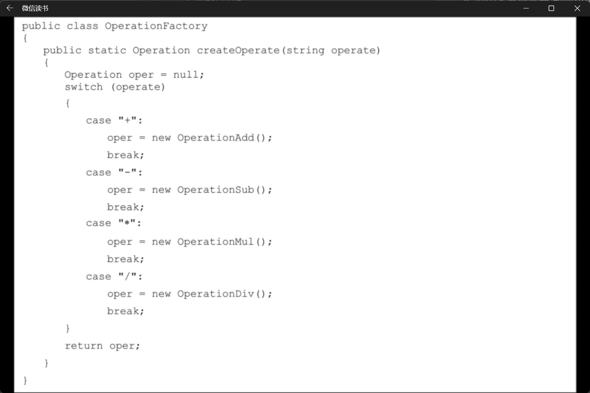
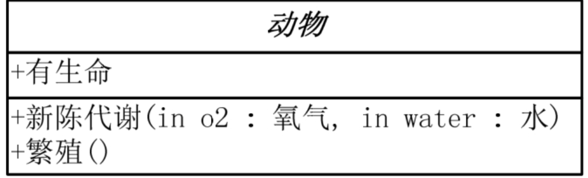
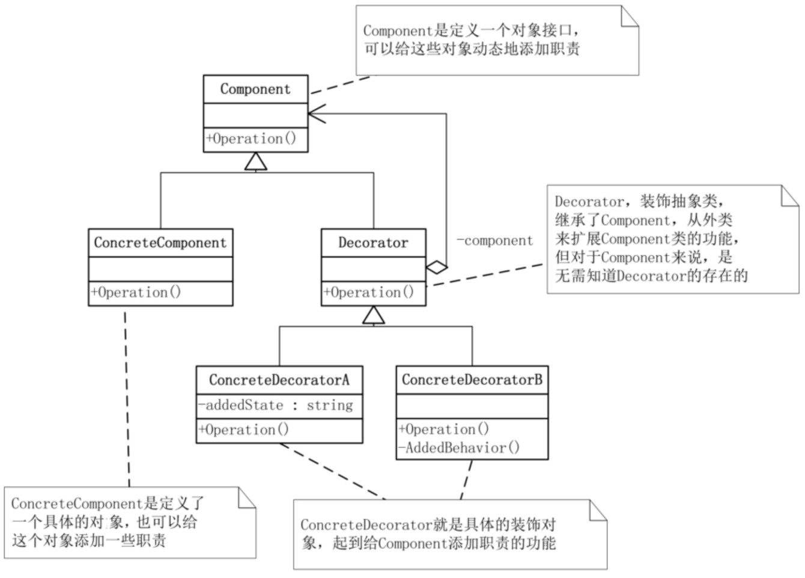
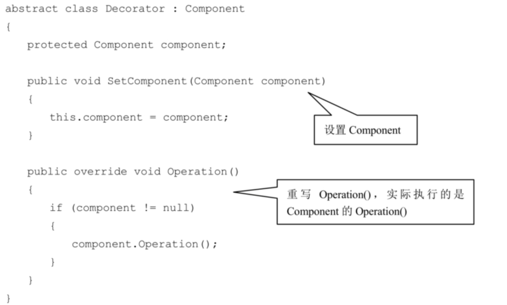
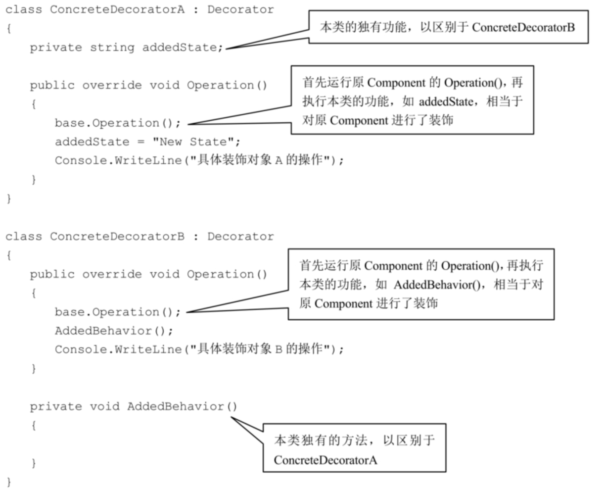

# 0.面向对象

1. 变量私有的叫字段，公有的是属性
2. 封装
   1. 良好的封装能够减少耦合
   2. 良好的封装能够减少耦合
   3. 类具有清晰的对外接口

---

1. 对象继承代表了一种 ‘is-a’ 的关系，如果两个对象A和B，可以描述为‘B是A’，则表明B可以继承A
2. 当两个类之间是‘has-a’的关系时，表示某个角色具有某一项责任，此时不合适用继承。比如人有两只手，手不能继承人；再比如飞机场有飞机，这飞机也不能去继承飞机场。

---

1. 多态表示不同的对象可以执行相同的动作，但要通过它们自己的实现代码来执行。

---

1. 接口是把隐式公共方法和属性组合起来，以封装特定功能的一个集合。

   一旦类实现了接口，类就可以支持接口所指定的所有属性和成员。

   声明接口在语法上与声明抽象类完全相同，但不允许提供接口中任何成员的执行方式。

2. 抽象类可以给出一些成员的实现，接口却不包含成员的实现，抽象类的抽象成员可被子类部分实现，接口的成员需要实现类完全实现，一个类只能继承一个抽象类，但可实现多个接口等等。

3. 类是对对象的抽象；抽象类是对类的抽象；接口是对行为的抽象。

4. 如果行为跨越不同类的对象，可使用接口

5. 从设计角度讲，抽象类是从子类中发现了公共的东西，泛化出父类，然后子类继承父类，而接口是根本不知子类的存在，方法如何实现还不确认，预先定义

6. 通过重构改善既有代码的设计

7. 事实上，只有小猫的时候，你就去设计一个动物类，这就极有可能会成为过度设计了。所以说抽象类往往都是通过重构得来的

8. 抽象类是自底而上抽象出来的，而接口则是自顶向下设计出来的

---

# 1.简单工厂模式

## 1.面向对象的好处

1. 可维护
2. 可复用
3. 可扩展
4. 灵活性高

通过封装、继承和多态降低程序之间的耦合度，使用设计模式达到上面四个点

---

## 2.业务的封装

添加新业务时，应尽量减少对现有业务逻辑的影响

---

## 3.简单工厂模式



---

## 4.UML类图

### 1.类

类图分三层，第一层显示类的名称，如果是抽象类，则就用斜体显示。

第二层是类的特性，通常就是字段和属性。

第三层是类的操作，通常是方法或行为。注意前面的符号，‘+’表示public，‘-’表示private，‘#’表示protected。”



---

### 2.接口

与类图的区别主要是顶端有<<interface>>显示。第一行是接口名称，第二行是接口方法。接口还有另一种表示方法，俗称棒棒糖表示法


---

### 3.继承关系

继承关系用空心三角形+实线来表示


---

### 4.接口实现

实现接口用空心三角形+虚线来表示


---

### 5.关联关系

当一个类‘知道’另一个类时，可以用关联（association）。关联关系用实线箭头来表示


---

### 6.聚合关系

聚合关系用空心的菱形+实线箭头来表示


---

### 7.合成关系

合成关系用实心的菱形+实线箭头来表示。另外，你会注意到合成关系的连线两端还有一个数字‘1’和数字‘2’，这被称为基数。表明这一端的类可以有几个实例，很显然，一个鸟应该有两只翅膀。如果一个类可能有无数个实例，则就用‘n’来表示。关联关系、聚合关系也可以有基数的


---

### 8.依赖关系

依赖关系（Dependency），用虚线箭头来表示


---

# 2.策略者模式

## 1.

面向对象的编程，并不是类越多越好，类的划分是为了封装，但分类的基础是抽象，具有相同属性和功能的对象的抽象集合才是类

---

## 2.策略模式代码


```java
//StrategyExample test application

class StrategyExample {

    public static void main(String[] args) {
        Context context;
        // Three contexts following different strategies
        context = new Context(new FirstStrategy());
        context.execute();

    }

}

// The classes that implement a concrete strategy should implement this

// The context class uses this to call the concrete strategy
interface Strategy {

    void execute();
    
}

// Implements the algorithm using the strategy interface
class FirstStrategy implements Strategy {

    public void execute() {
        System.out.println("Called FirstStrategy.execute()");
    }
    
}

class SecondStrategy implements Strategy {

    public void execute() {
        System.out.println("Called SecondStrategy.execute()");
    }
    
}

class ThirdStrategy implements Strategy {

    public void execute() {
        System.out.println("Called ThirdStrategy.execute()");
    }
    
}

// Configured with a ConcreteStrategy object and maintains a reference to a Strategy object
class Context {

    Strategy strategy;

    // Constructor
    public Context(Strategy strategy) {
        this.strategy = strategy;
    }

    public void execute() {
        this.strategy.execute();
    }

}
```

---

## 3.与简单工厂模式结合

```java 
public class Context {
    private Strategy strategy;

    public Context(int i) {
        switch (i) {
            case 1 -> strategy = new FirstStrategy();
            case 2 -> strategy = new SecondStrategy();
        }
    }

    public void execute() {
        this.strategy.execute();
    }
}
```

结合后客户端就不需要认识对应的策略对象只需要传递对应的值即可，降低耦合度

---

# 3.单一职责原则

就一个类而言，应该仅有一个引起它变化的原因

如果一个类承担的职责过多，就等于把这些职责耦合在一起，一个职责的变化可能会削弱或者抑制这个类完成其他职责的能力。

这种耦合会导致脆弱的设计，当变化发生时，设计会遭受到意想不到的破坏

---

# 4.开放-封闭原则

开放-封闭原则，是说软件实体（类、模块、函数等等）应该可以扩展，但是不可修改

这个原则其实是有两个特征，一个是说‘对于扩展是开放的（Open for extension）’，另一个是说‘对于更改是封闭的（Closed for modification）

无论模块是多么的‘封闭’，都会存在一些无法对之封闭的变化。

既然不可能完全封闭，设计人员必须对于他设计的模块应该对哪种变化封闭做出选择。

他必须先猜测出最有可能发生的变化种类，然后构造抽象来隔离那些变化

>在我们最初编写代码时，假设变化不会发生。当变化发生时，我们就创建抽象来隔离以后发生的同类变化
>
>面对需求，对程序的改动是通过增加新代码进行的，而不是更改现有的代码

我们希望的是在开发工作展开不久就知道可能发生的变化。查明可能发生的变化所等待的时间越长，要创建正确的抽象就越困难

开放-封闭原则是面向对象设计的核心所在。遵循这个原则可以带来面向对象技术所声称的巨大好处，也就是可维护、可扩展、可复用、灵活性好。开发人员应该仅对程序中呈现出频繁变化的那些部分做出抽象，然而，对于应用程序中的每个部分都刻意地进行抽象同样不是一个好主意。拒绝不成熟的抽象和抽象本身一样重要

---

# 5.依赖倒装

## 1.依赖倒转原则

```
高层模块不应该依赖低层模块。两个都应该依赖抽象。
```


```
抽象不应该依赖细节。细节应该依赖抽象。
```

---

## 2.里氏代换原则

>一个软件实体如果使用的是一个父类的话，那么一定适用于其子类，而且它察觉不出父类对象和子类对象的区别。也就是说，在软件里面，把父类都替换成它的子类，程序的行为没有变化

```
里氏代换原则（LSP）：子类型必须能够替换掉它们的父类型
```

>由于子类型的可替换性才使得使用父类类型的模块在无需修改的情况下就可以扩展

---

>依赖倒转其实可以说是面向对象设计的标志，用哪种语言来编写程序不重要，如果编写时考虑的都是如何针对抽象编程而不是针对细节编程，即程序中所有的依赖关系都是终止于抽象类或者接口，那就是面向对象的设计，反之那就是过程化的设计了

---

# 6.装饰者模式

>装饰模式（Decorator），动态地给一个对象添加一些额外的职责，就增加功能来说，装饰模式比生成子类更为灵活



Component是定义一个对象接口，可以给这些对象动态地添加职责。

ConcreteComponent 是定义了一个具体的对象，也可以给这个对象添加一些职责。

Decorator，装饰抽象类，继承了Component，从外类来扩展Component类的功能，但对于Component来说，是无需知道Decorator的存在的。

至于 ConcreteDecorator 就是具体的装饰对象，起到给Component添加职责的功能

```java 
abstract class Component
{
    public abstract void Operation();
}
```

```java
class ConcreteComponent : Component
{
    public override void Operation()
    {
        Console.WriteLine("具体对象的操作");
    }
}
```






>装饰模式是利用SetComponent来对对象进行包装的。这样每个装饰对象的实现就和如何使用这个对象分离开了，每个装饰对象只关心自己的功能，不需要关心如何被添加到对象链当中


>如果只有一个ConcreteComponent类而没有抽象的Component类，那么Decorator类可以是ConcreteComponent的一个子类。同样道理，如果只有一个ConcreteDecorator类，那么就没有必要建立一个单独的Decorator类，而可以把Decorator和ConcreteDecorator的责任合并成一个类

---
