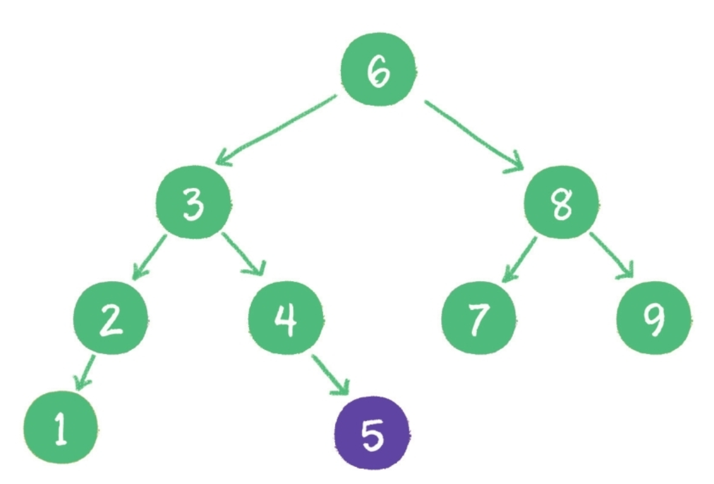

# 1.算法概论

## 1.数据结构

1. 线性结构线性结构是最简单的数据结构，包括数组、链表，以及由它们衍生出来的栈、队列、哈希表。

   

2. 树树是相对复杂的数据结构，其中比较有代表性的是二叉树，由它又衍生出了二叉堆之类的数据结构。


3. 图是更为复杂的数据结构，因为在图中会呈现出多对多的关联关系。


4. 其他数据结构除上述所列的几种基本数据结构以外，还有一些其他的千奇百怪的数据结构。它们由基本数据结构变形而来，用于解决某些特定问题，如跳表、哈希链表、位图等。

---

# 2.数据结构基础

## 1.数组VS链表


---


## 2.物理结构与逻辑结构

如果把数据结构比作活生生的人，那么物理结构就是人的血肉和骨骼，看得见，摸得着，实实在在。例如我们刚刚学过的数组和链表，都是内存中实实在在的存储结构。而在物质的人体之上，还存在着人的思想和精神，它们看不见、摸不着。看过电影《阿凡达》 吗？男主角的思想意识从一个瘦弱残疾的人类身上被移植到一个高大威猛的蓝皮肤外星人身上，虽然承载思想意识的肉身改变了，但是人格却是唯一的。如果把物质层面的人体比作数据存储的物理结构，那么精神层面的人格则是数据存储的逻辑结构。逻辑结构是抽象的概念，它依赖于物理结构而存在。


---

# 3.树

## 1.使用数组表示二叉树


使用数组存储时，会按照层级顺序把二叉树的节点放到数组中对应的位置上。

如果某一个节点的左孩子或右孩子空缺，则数组的相应位置也空出来。

为什么这样设计呢？因为这样可以更方便地在数组中定位二叉树的孩子节点和父节点。

假设一个父节点的下标是`parent`，那么它的左孩子节点下标就是`2×parent+1`；右孩子节点下标就是`2×parent+2`。

反过来，假设一个左孩子节点的下标是 `leftChild` ，那么它的父节点下标就是`（leftChild-1）/2`。

假如节点4在数组中的下标是3，节点4是节点2的左孩子，节点2的下标可以直接通过计算得出。节点2的下标=`（3-1）/2=1`

---

## 2.满二叉树

一个二叉树的所有非叶子节点都存在左右孩子，并且所有叶子节点都在同一层级上，那么这个树就是满二叉树。


简单点说，满二叉树的每一个分支都是满的。

---

## 3.完全二叉树

对一个有n个节点的二叉树，按层级顺序编号，则所有节点的编号为从1到n。

如果这个树所有节点和同样深度的满二叉树的编号为从1到n的节点位置相同，则这个二叉树为完全二叉树。


在上图中，二叉树编号从1到12的12个节点，和前面满二叉树编号从1到12的节点位置完全对应。因此这个树是完全二叉树。

完全二叉树的条件没有满二叉树那么苛刻：满二叉树要求所有分支都是满的；而完全二叉树只需保证最后一个节点之前的节点都齐全即可。

---

## 4.二叉查找树

二叉树的树形结构使它很适合扮演索引的角色。二叉查找树（binary search tree）

这种二叉树的主要作用就是进行查找操作。

二叉查找树在二叉树的基础上增加了以下几个条件。

* 如果左子树不为空，则左子树上所有节点的值均小于根节点的值

* 如果右子树不为空，则右子树上所有节点的值均大于根节点的值

* 左、右子树也都是二叉查找树


对于一个节点分布相对均衡的二叉查找树来说，如果节点总数是n，那么搜索节点的时间复杂度就是O（logn），和树的深度是一样的。

这种依靠比较大小来逐步查找的方式，和二分查找算法非常相似。

---

### 1.维持相对顺序

二叉查找树要求左子树小于父节点，右子树大于父节点，正是这样保证了二叉树的有序性。

因此二叉查找树还有另一个名字——二叉排序树（binary sort tree）。

新插入的节点，同样要遵循二叉排序树的原则。例如插入新元素5，由于5＜6，5＞3，5＞4，所以5最终会插入到节点4的右孩子位置。



再如插入新元素10，由于10＞6，10＞8，10＞9，所以10最终会插入到节点9的右孩子位置


这一切看起来很顺利，然而却隐藏着一个致命的问题。

什么问题呢？

下面请试着在二叉查找树中依次插入9、8、7、6、5、4，看看会出现什么结果。


不只是外观看起来变得怪异了，查询节点的时间复杂度也退化成了O（n）。

怎么解决这个问题呢？这就涉及二叉树的自平衡了。

二叉树自平衡的方式有多种，如红黑树、AVL树、树堆等。

---

## 5.二叉树遍历

1. 前序遍历
2. 中序遍历
3. 后序遍历
4. 层序遍历

从更宏观的角度来看，二叉树的遍历归结为两大类。

1. 深度优先遍历（前序遍历、中序遍历、后序遍历）。

2. 广度优先遍历（层序遍历）。

---

### 1.深度优先遍历

深度优先和广度优先这两个概念不止局限于二叉树，它们更是一种抽象的算法思想，决定了访问某些复杂数据结构的顺序。

在访问树、图，或其他一些复杂数据结构时，这两个概念常常被使用到。

所谓深度优先，顾名思义，就是偏向于纵深，“一头扎到底”的访问方式。

---

#### 1.前序遍历

二叉树的前序遍历，输出顺序是根节点、左子树、右子树。


上图就是一个二叉树的前序遍历，每个节点左侧的序号代表该节点的输出顺序，详细步骤如下。

1.首先输出的是根节点1。


2.由于根节点1存在左孩子，输出左孩子节点2。


3.由于节点2也存在左孩子，输出左孩子节点4。


4.节点4既没有左孩子，也没有右孩子，那么回到节点2，输出节点2的右孩子节点5。


5.节点5既没有左孩子，也没有右孩子，那么回到节点1，输出节点1的右孩子节点3。


6.节点3没有左孩子，但是有右孩子，因此输出节点3的右孩子节点6。


到此为止，所有的节点都遍历输出完毕。

---

#### 2.中序遍历

二叉树的中序遍历，输出顺序是左子树、根节点、右子树。

每个节点左侧的序号代表该节点的输出顺序，详细步骤如下。

1.首先访问根节点的左孩子，如果这个左孩子还拥有左孩子，则继续深入访问下去，一直找到不再有左孩子的节点，并输出该节点。显然，第一个没有左孩子的节点是节点4。

2.依照中序遍历的次序，接下来输出节点4的父节点2。

3.再输出节点2的右孩子节点5。

4.以节点2为根的左子树已经输出完毕，这时再输出整个二叉树的根节点1。

5.由于节点3没有左孩子，所以直接输出根节点1的右孩子节点3。

6.最后输出节点3的右孩子节点6。到此为止，所有的节点都遍历输出完毕。

---

#### 3.后续遍历

二叉树的后序遍历，输出顺序是左子树、右子树、根节点。


上图就是一个二叉树的后序遍历，每个节点左侧的序号代表该节点的输出顺序。

---

#### 4.使用递归的方式实现

```java
public List<Integer> preorderTraversal(TreeNode root) {
        ArrayList<Integer> res = new ArrayList<>();
        if (root == null) return res;
        res.add(root.val);
        res.addAll(preorderTraversal(root.left));
        res.addAll(preorderTraversal(root.right));
        return res;
    }

private void tree(TreeNode root, ArrayList<Integer> res) {
        if (root == null) return;
        //前序遍历
        tree(root.left, res);
    	//中序遍历
        tree(root.right, res);
    	//后序遍历
    }

```

二叉树用递归方式来实现前序、中序、后序遍历，是最为自然的方式，因此代码也非常简单。

这3种遍历方式的区别，仅仅是输出的执行位置不同：前序遍历的输出在前，中序遍历的输出在中间，后序遍历的输出在最后。

---

#### 5.使用栈模拟递归方法栈


---

### 2.层序遍历

使用队列

---

## 6.二叉堆

二叉堆本质上是一种完全二叉树，它分为两个类型。

1. 最大堆。

   任何一个父节点都大于或等于它的子节点

2. 最小堆。

   任何一个父节点都小于或等于它的子节点

所以二叉堆的根节点就是整个堆的最大或最小节点

---

### 1.插入元素

在最尾端插入

1. 当二叉堆插入节点时，插入位置是完全二叉树的最后一个位置。例如插入一个新节点，值是0。

2. 这时，新节点的父节点5比0大，显然不符合最小堆的性质。于是让新节点“上浮”，和父节点交换位置。

3. 继续用节点0和父节点3做比较，因为0小于3，则让新节点继续“上浮”。

4. 继续比较，最终新节点0“上浮”到了堆顶位置。

时间复杂度 O（logn）

---

### 2.删除元素

删除堆顶元素后尾端元素移植顶端开始下沉

1. 二叉堆删除节点的过程和插入节点的过程正好相反，所删除的是处于堆顶的节点。例如删除最小堆的堆顶节点1。

2. 这时，为了继续维持完全二叉树的结构，我们把堆的最后一个节点10临时补到原本堆顶的位置。

3. 接下来，让暂处堆顶位置的节点10和它的左、右孩子进行比较，如果左、右孩子节点中最小的一个（显然是节点2）比节点10小，那么让节点10“下沉”。

4. 继续让节点10和它的左、右孩子做比较，左、右孩子中最小的是节点7，由于10大于7，让节点10继续“下沉”。

5. 这样一来，二叉堆重新得到了调整。

时间复杂度 O（logn）

---

### 3.构建二叉堆

1. 构建二叉堆，也就是把一个无序的完全二叉树调整为二叉堆，本质就是让所有非叶子节点依次“下沉”。

2. 首先，从最后一个非叶子节点开始，也就是从节点10开始。如果节点10大于它左、右孩子节点中最小的一个，则节点10“下沉”。

3. 接下来轮到节点3，如果节点3大于它左、右孩子节点中最小的一个，则节点3“下沉”。

4. 然后轮到节点1，如果节点1大于它左、右孩子节点中最小的一个，则节点1“下沉”。事实上节点1小于它的左、右孩子，所以不用改变。接下来轮到节点7，如果节点7大于它左、右孩子节点中最小的一个，则节点7“下沉”。

5. 节点7继续比较，继续“下沉”。

6. 经过上述几轮比较和“下沉”操作，最终每一节点都小于它的左、右孩子节点，一个无序的完全二叉树就被构建成了一个最小堆。 

时间复杂度 O（n）

---

### 4.二叉堆的实现

一般不采取链式接口来存储，一般使用数组来存储

假设父节点的下标是parent，那么它的左孩子下标就是 2×parent+1；右孩子下标就是2×parent+2。

---

## 7.优先队列

优先队列分为最大优先队列和最小优先队列。

在最大优先队列中，无论入队顺序如何，当前最大的元素都会优先出队，这是基于最大堆实现的。

在最小优先队列中，无论入队顺序如何，当前最小的元素都会优先出队，这是基于最小堆实现的。

---

# 4.排序算法

## 1.常见的排序算法

### 1.时间复杂度为O（n2）的排序算法

- 冒泡排序
- 选择排序
- 插入排序
- 希尔排序

>（希尔排序比较特殊，它的性能略优于O（n2），但又比不		上O（nlogn），姑且把它归入本类）

---

### 2.时间复杂度为O（nlogn）的排序算法

- 快速排序
- 归并排序
- 堆排序

---

### 3.时间复杂度为线性的排序算法

- 计数排序
- 桶排序
- 基数排序

---

### 4.稳定与不稳定排序

即如果值相同的元素在排序后仍然保持着排序前的顺序，则这样的排序算法是稳定排序；

如果值相同的元素在排序后打乱了排序前的顺序，则这样的排序算法是不稳定排序。

---

## 2.冒泡排序

### 1.优化版本

利用布尔变量isSorted作为标记。

如果在本轮排序中，元素有交换，则说明数列无序；

如果没有元素交换，则说明数列已然有序，然后直接跳出大循环。

---

### 2.优化版本

我们可以在每一轮排序后，记录下来最后一次元素交换的位置，该位置即为无序数列的边界，再往后就是有序区了。

---

## 3.鸡尾酒排序

排序过程就像钟摆一样，第1轮从左到右，第2轮从右到左，第3轮再从左到右……

代码外层的大循环控制着所有排序回合，大循环内包含2个小循环，第1个小循环从左向右比较并交换元素，第2个小循环从右向左比较并交换元素。

优点：在特定情况减少排序回合数

缺点：代码量增加

---

## 4.快速排序

