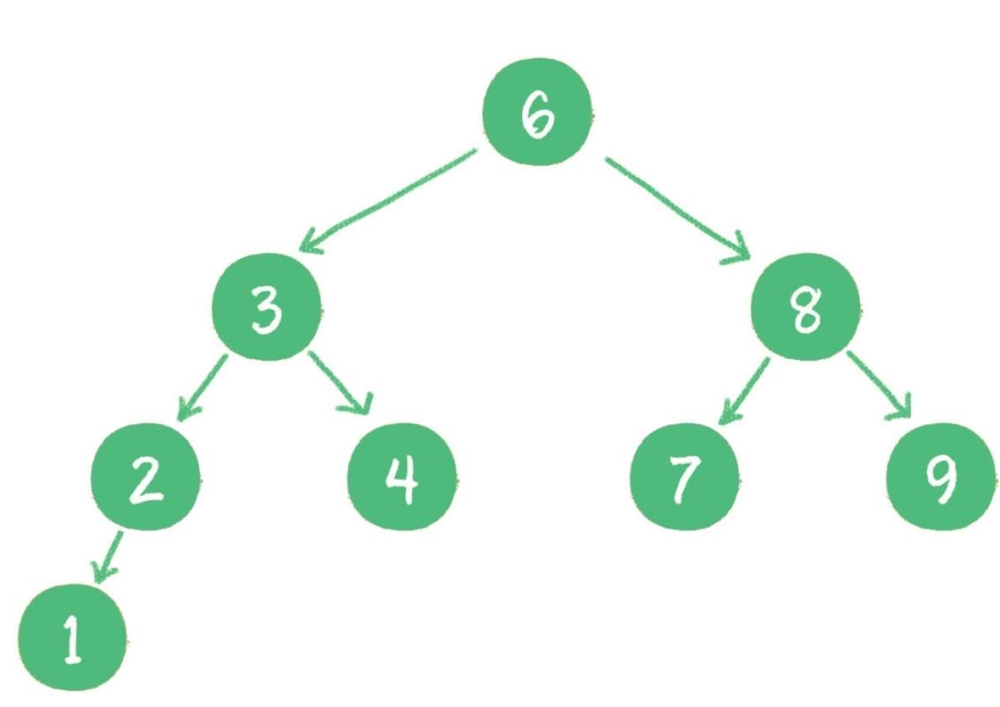

# 1.算法概论

## 1.数据结构

1. 线性结构线性结构是最简单的数据结构，包括数组、链表，以及由它们衍生出来的栈、队列、哈希表。

   

2. 树树是相对复杂的数据结构，其中比较有代表性的是二叉树，由它又衍生出了二叉堆之类的数据结构。

3. 图是更为复杂的数据结构，因为在图中会呈现出多对多的关联关系。

4. 其他数据结构除上述所列的几种基本数据结构以外，还有一些其他的千奇百怪的数据结构。它们由基本数据结构变形而来，用于解决某些特定问题，如跳表、哈希链表、位图等。

---

# 2.数据结构基础

## 1.数组VS链表

---

## 2.物理结构与逻辑结构

如果把数据结构比作活生生的人，那么物理结构就是人的血肉和骨骼，看得见，摸得着，实实在在。例如我们刚刚学过的数组和链表，都是内存中实实在在的存储结构。而在物质的人体之上，还存在着人的思想和精神，它们看不见、摸不着。看过电影《阿凡达》 吗？男主角的思想意识从一个瘦弱残疾的人类身上被移植到一个高大威猛的蓝皮肤外星人身上，虽然承载思想意识的肉身改变了，但是人格却是唯一的。如果把物质层面的人体比作数据存储的物理结构，那么精神层面的人格则是数据存储的逻辑结构。逻辑结构是抽象的概念，它依赖于物理结构而存在。

---

# 3.树

## 1.使用数组表示二叉树

使用数组存储时，会按照层级顺序把二叉树的节点放到数组中对应的位置上。

如果某一个节点的左孩子或右孩子空缺，则数组的相应位置也空出来。

为什么这样设计呢？因为这样可以更方便地在数组中定位二叉树的孩子节点和父节点。

假设一个父节点的下标是`parent`，那么它的左孩子节点下标就是`2×parent+1`；右孩子节点下标就是`2×parent+2`。

反过来，假设一个左孩子节点的下标是 `leftChild` ，那么它的父节点下标就是`（leftChild-1）/2`。

假如节点4在数组中的下标是3，节点4是节点2的左孩子，节点2的下标可以直接通过计算得出。节点2的下标=`（3-1）/2=1`

---

## 2.满二叉树

一个二叉树的所有非叶子节点都存在左右孩子，并且所有叶子节点都在同一层级上，那么这个树就是满二叉树。

简单点说，满二叉树的每一个分支都是满的。

---

## 3.完全二叉树

对一个有n个节点的二叉树，按层级顺序编号，则所有节点的编号为从1到n。

如果这个树所有节点和同样深度的满二叉树的编号为从1到n的节点位置相同，则这个二叉树为完全二叉树。

在上图中，二叉树编号从1到12的12个节点，和前面满二叉树编号从1到12的节点位置完全对应。因此这个树是完全二叉树。

完全二叉树的条件没有满二叉树那么苛刻：满二叉树要求所有分支都是满的；而完全二叉树只需保证最后一个节点之前的节点都齐全即可。

---

## 4.二叉查找树

二叉树的树形结构使它很适合扮演索引的角色。二叉查找树（binary search tree）

这种二叉树的主要作用就是进行查找操作。

二叉查找树在二叉树的基础上增加了以下几个条件。

* 如果左子树不为空，则左子树上所有节点的值均小于根节点的值

* 如果右子树不为空，则右子树上所有节点的值均大于根节点的值

* 左、右子树也都是二叉查找树

对于一个节点分布相对均衡的二叉查找树来说，如果节点总数是n，那么搜索节点的时间复杂度就是O（logn），和树的深度是一样的。

这种依靠比较大小来逐步查找的方式，和二分查找算法非常相似。

---

### 1.维持相对顺序

二叉查找树要求左子树小于父节点，右子树大于父节点，正是这样保证了二叉树的有序性。

因此二叉查找树还有另一个名字——二叉排序树（binary sort tree）。

新插入的节点，同样要遵循二叉排序树的原则。例如插入新元素5，由于5＜6，5＞3，5＞4，所以5最终会插入到节点4的右孩子位置。

再如插入新元素10，由于10＞6，10＞8，10＞9，所以10最终会插入到节点9的右孩子位置

这一切看起来很顺利，然而却隐藏着一个致命的问题。

什么问题呢？

下面请试着在二叉查找树中依次插入9、8、7、6、5、4，看看会出现什么结果。

不只是外观看起来变得怪异了，查询节点的时间复杂度也退化成了O（n）。

怎么解决这个问题呢？这就涉及二叉树的自平衡了。

二叉树自平衡的方式有多种，如红黑树、AVL树、树堆等。

---

## 5.二叉树遍历

### 1.递归遍历

